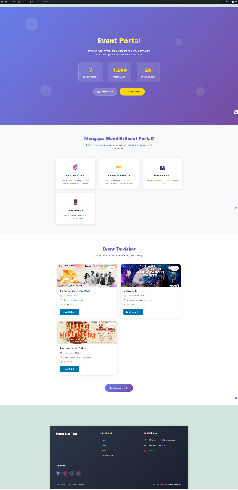
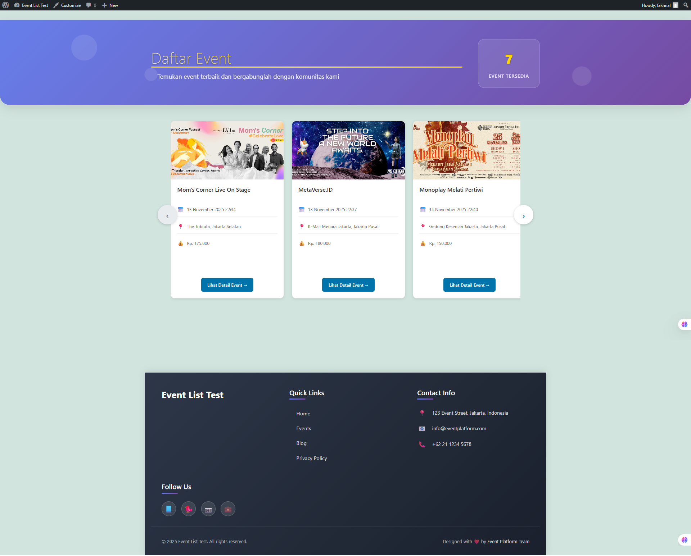
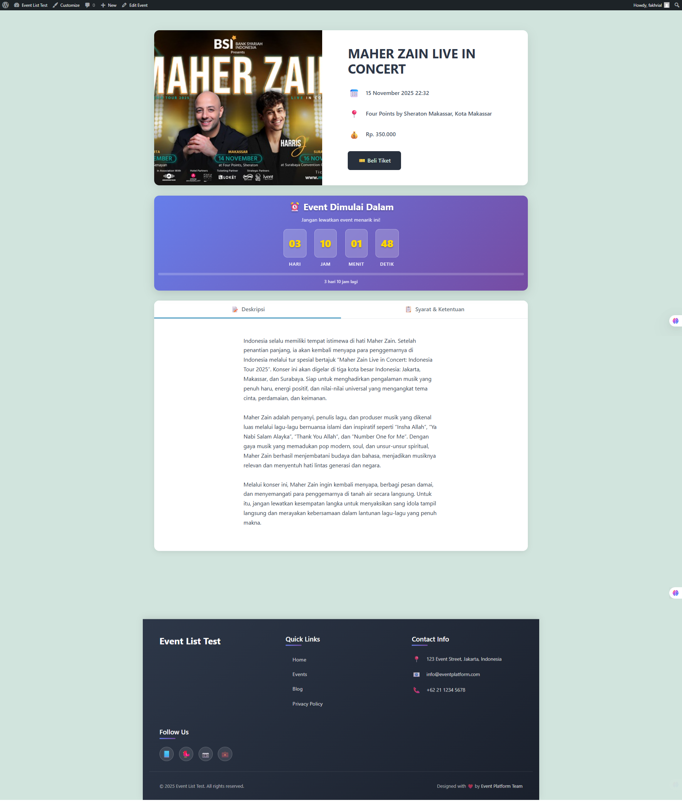

# WordPress Event Platform

A modern and feature-rich event management platform built with WordPress, featuring custom post types, advanced event listings, countdown timers, and a responsive design.

## 📸 Screenshots


*Modern homepage with hero section and event highlights*


*Event archive with slider navigation*


*Single event page with countdown timer and registration*

### Server Requirements
- PHP 8.0 or higher
- MySQL 5.7 or MariaDB 10.2 or higher
- WordPress 6.0 or higher
- Web server (Apache/Nginx)
- SSL certificate (recommended for production)

### Local Development
- XAMPP, WAMP, MAMP, or similar local server environment
- Git installed
- Modern web browser
- Code editor (VS Code recommended)

## 🚀 Quick Start

### 1. Clone the Repository

```bash
git clone https://github.com/yourusername/wordpress-event-platform.git
cd wordpress-event-platform
```

### Local Development Setup

#### Using XAMPP (Recommended)

1. **Install XAMPP**
   - Download and install [XAMPP](https://www.apachefriends.org/)
   - Start Apache and MySQL services from XAMPP Control Panel

2. **Setup Database**
   ```bash
   # Open phpMyAdmin via http://localhost/phpmyadmin
   # Create new database: wordpress_event
   # Import the provided SQL file (if available)
   ```

3. **Configure WordPress**
   - Copy `wp-config-sample.php` to `wp-config.php`
   - Update database credentials:
   ```php
   define('DB_NAME', 'wordpress_event');
   define('DB_USER', 'root');
   define('DB_PASSWORD', '');
   define('DB_HOST', 'localhost');
   ```

4. **Access Your Site**
   - Navigate to `http://localhost/wordpress-event-test/`
   - Complete WordPress installation through the web interface

## 📁 Project Structure

```
wordpress-event-test/
├── wp-content/
│   └── themes/
│       └── twentytwentyone/
│           ├── functions-events.php          # Event-specific functions
│           ├── front-page.php                # Custom homepage template
│           ├── page-upcoming-events.php      # Upcoming events page
│           ├── single-my_event.php           # Single event template
│           ├── archive-events.php            # Event archive template
│           ├── footer.php                    # Custom footer
│           └── template-parts/
│               └── header/
│                   ├── site-header.php        # Main navigation
│                   └── entry-header.php      # Entry header (modified)
├── wp-config.php                             # WordPress configuration
├── .htaccess                                 # Apache configuration
└── README.md                                # This file
```

**Built with ❤️ by Fakhri Al Fatah**

Made with WordPress, PHP, and modern web technologies.